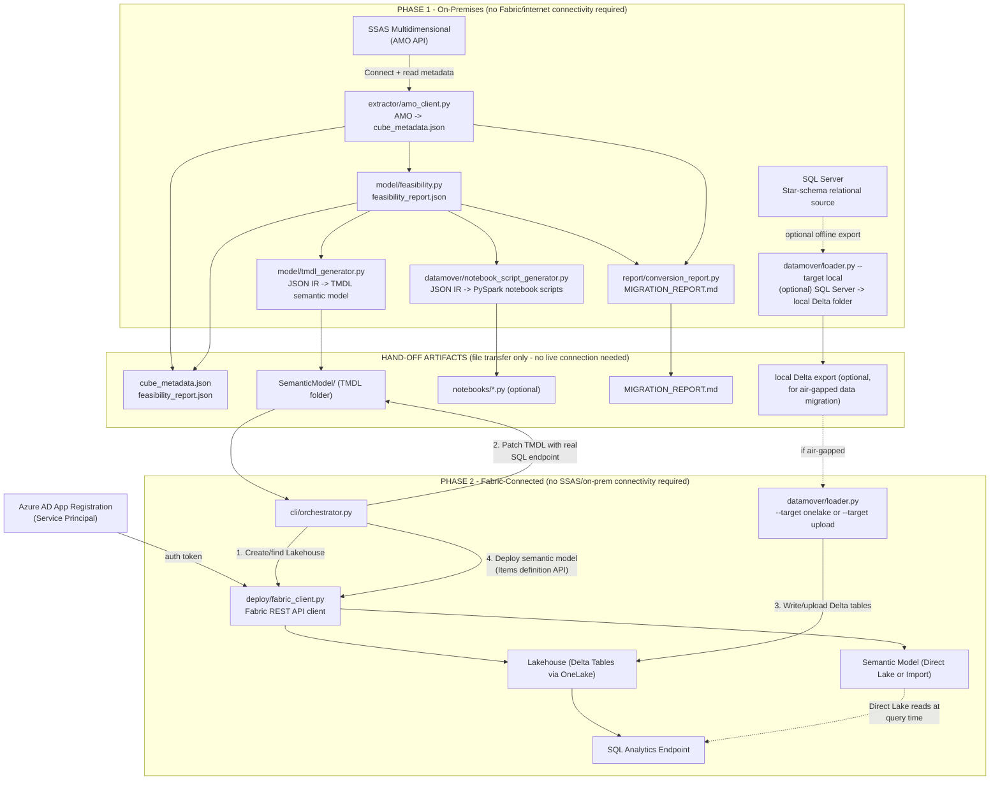

# SSAS Multidimensional (MDX) Cube → Microsoft Fabric Migration Tool (with Web UI)

A code-based accelerator that migrates an on-premises **SQL Server Analysis
Services (SSAS) Multidimensional** cube to **Microsoft Fabric**, producing a
Direct Lake (or Import, with documented reasons) Power BI semantic model
backed by Delta tables in a Fabric Lakehouse. This repository includes a
built-in **Streamlit Web UI** ([Section 11](#11-web-ui)) as the primary,
no-code way to drive the whole pipeline from a browser - every step is also
available as a CLI command for scripting/automation, but the Web UI is a
core, fully-supported part of this tool, not a bolt-on extra. (Looking for a
pure code-first/CLI-only version with no UI? See
[SSAS_MDXCube_to_Fabric_Migration_Tool](https://github.com/sagarbathe/SSAS_MDXCube_to_Fabric_Migration_Tool).)

---

## Getting Started: Get This Repo Onto Your Machine (Do This First)

Every step below - including installing/running the [Web UI](#11-web-ui)
in Section 11 - assumes you already have a local copy of this repository on
whichever machine(s) you'll run it from. Do this before anything else:

```powershell
git clone https://github.com/sagarbathe/SSAS_MDXCube_to_Fabric_Migration_UI_Tool.git
cd SSAS_MDXCube_to_Fabric_Migration_UI_Tool
```

No `git` installed? Click the green **Code -> Download ZIP** button on the
repo's GitHub page instead, then extract it anywhere on the machine. Either
way, run every command in this README (and launch the Web UI) **from
inside that folder** - it contains the pipeline code, `config/.env.template`
(the source of the `.env` file you'll create in [Section 5](#5-phase-1-on-prem-ssas--sql-server)/
[Section 6](#6-phase-2-fabric-connected)), and everything else referenced
below. If you're running Phase 1 and Phase 2 on separate machines (see
[Section 2](#2-two-phase-design-on-prem-vs-fabric-connected)), clone/copy
the repo onto each machine that will run any step.

---

## 1. Purpose / Objective

Organizations with legacy SSAS Multidimensional (MDX) cubes need a
repeatable, low-risk path to Microsoft Fabric. Rebuilding a semantic model
by hand is slow and error-prone (measures, hierarchies, relationships, and
data types must all be re-derived correctly from the cube). This tool
automates that process end-to-end:

1. **Extracts** the full metadata of a running SSAS Multidimensional cube
   (dimensions, attributes, hierarchies, measure groups, measures,
   relationships, calculated members, KPIs, data source/DSV schema) via the
   **AMO (Analysis Management Objects)** API - Microsoft's .NET client
   library (`Microsoft.AnalysisServices.dll`) for programmatically managing
   SSAS objects, accessed from Python via `pythonnet`/`clr`
   (`extractor/amo_client.py`) and from PowerShell directly (the
   `demo-cube-setup/_deploy_amo_*.ps1` scripts use it to *create* the demo
   cubes). AMO supports **Windows Integrated Authentication only** (no SQL
   auth), and the connecting account needs the **Server Administrator**
   (or Database Administrator) role on the SSAS instance - see
   [Section 3](#3-prerequisites) and [Section 5](#5-phase-1-on-prem-ssas--sql-server).
2. **Analyzes** the extracted metadata against known Microsoft Fabric
   **Direct Lake** constraints and recommends Direct Lake or Import mode
   *per cube*, with specific, itemized reasons for any fallback.
3. **Generates**:
   - A TMDL (Tabular Model Definition Language) semantic model folder,
     with tables, columns, relationships, DAX measures (translated from MDX
     aggregation functions), and hierarchies.
   - Fabric notebook (PySpark) scripts that create/refresh the equivalent
     Delta tables, for teams who want a Spark-based, gateway/mirroring-fed
     load path.
   - A **Migration Conversion Report** (`MIGRATION_REPORT.md`) - a single
     document stating exactly what was converted automatically and what
     was not, with a suggested manual alternative for every item that
     wasn't (see [Section 8](#8-the-migration-conversion-report)).
4. **Migrates data**: extracts the underlying star-schema tables from the
   on-premises relational source and writes them as Delta tables into a
   Fabric Lakehouse via OneLake (no Spark cluster, gateway, or mirroring
   required for this path) - either directly, or via an offline
   export/upload bridge for environments where on-prem and Fabric networks
   are not mutually reachable.
5. **Deploys**: creates/updates the Lakehouse and the Semantic Model items
   in a target Fabric workspace via the Fabric REST API, using a service
   principal (unattended, repeatable automation).

The tool is **generic** — it is not hard-coded to any one cube. Point it at
any SSAS Multidimensional server/database connection string and it will
extract and convert that cube's structure.

---

## 2. Two-Phase Design: On-Prem vs. Fabric-Connected

Many enterprises run SSAS on a network segment that has **no direct route
to the internet/Fabric** (and, conversely, no Fabric-connected machine can
reach the on-prem SSAS/SQL Server). This tool is deliberately split into two
independent phases so it still works in that common scenario, with a clear,
minimal set of hand-off artifacts between them.

| | Phase 1 - On-Prem | Phase 2 - Fabric-Connected |
|---|---|---|
| **Runs on** | A machine that can reach the SSAS server and the on-prem SQL Server | A machine that can reach the Fabric REST API and OneLake (`*.fabric.microsoft.com`) |
| **Needs SSAS/AMO connectivity?** | Yes | No |
| **Needs Fabric/internet connectivity?** | No | Yes |
| **Steps** | extract → analyze → generate → report | deploy-lake → migrate-data (or upload-data) → deploy-model |
| **Produces** | `cube_metadata.json`, `feasibility_report.json`, `SemanticModel/` (TMDL folder), `notebooks/*.py`, `MIGRATION_REPORT.md`, optionally a local Delta export | A Lakehouse + Semantic Model deployed into the target Fabric workspace |
| **Consumes** | Nothing outside itself | The exact files produced by Phase 1 |

If a **single machine can reach both** the on-prem network and Fabric (the
scenario this repo was validated against), you can run every step from that
one machine back-to-back and skip the hand-off entirely - see
["Running everything from one machine"](#running-everything-from-one-machine-when-possible).
If not, follow [Section 5](#5-phase-1-on-prem-ssas--sql-server) fully, then
physically transfer the Phase 1 output folder to a Fabric-connected machine
before starting [Section 6](#6-phase-2-fabric-connected).

### Architecture



**Key design decisions:**

- **Phase 1 has zero external dependencies beyond SSAS/SQL Server.** No
  `azure-identity`, no Fabric REST calls, no OneLake writes happen until
  Phase 2 - so Phase 1 can run in a fully isolated network segment.
- **The hand-off surface is small and inspectable.** Everything Phase 2
  needs is plain JSON, TMDL (text), Python (`.py`) files, Markdown, and
  (optionally) a folder of Delta table files - all easy to review, zip, and
  transfer through whatever secure file-transfer process your organization
  already uses (there is no dependency on a specific transfer mechanism).
- **`migrate-data` vs `upload-data`:** if one machine/process really can
  reach both networks, `migrate-data` extracts straight from SQL Server and
  writes to OneLake in one step. If not, `datamover/loader.py --target
  local` (Phase 1, on-prem) followed by `--target upload` /
  `orchestrator --steps upload-data` (Phase 2, Fabric-connected) achieves
  the same result via a transferred folder instead of a live connection.
- **AMO (not DMVs)** is used for metadata extraction, for full object-model
  fidelity (partitions, storage modes, granularity attributes, DSV schema)
  that DMV/XMLA discovery alone does not always expose cleanly.
- **TMDL** (not TMSL/.bim) is the generation target because it is the
  format natively accepted by the Fabric "create/update item definition"
  REST API and is human-readable/diffable in source control.
- **Service principal auth** (not delegated/user auth) so Phase 2 can run
  unattended and repeatably (e.g., from a CI/CD pipeline in the future).

---

## 3. Prerequisites

### Phase 1 - On-Prem prerequisites

| # | Prerequisite | Why | How to verify |
|---|---|---|---|
| 1 | **x64 Python 3.10+** (not ARM64 - see [Limitations](#10-limitations)) | `pyarrow` and `deltalake` (used by the optional local Delta export) do not ship ARM64 Windows wheels at the time of writing | `python -c "import platform; print(platform.machine())"` prints `AMD64` |
| 2 | SQL Server **AMO** client library installed (installed automatically with SSMS or the SQL Server Feature Pack) | `extractor/amo_client.py` loads `Microsoft.AnalysisServices.dll` via `pythonnet` | `Get-ChildItem "C:\Program Files\Microsoft SQL Server" -Recurse -Filter "Microsoft.AnalysisServices.dll"` returns a path |
| 3 | Windows account used to run the extractor is a recognized **Analysis Services Server Administrator** (or the extractor is run from an elevated/admin session) | AS only lists/serves databases to identities it recognizes as admins | Connecting via SSMS (same account, same elevation) shows the target database under the AS server |
| 4 | ODBC Driver 17 or 18 for SQL Server installed | Needed only if you also run the optional local Delta export (`loader.py --target local`) | `python -c "import pyodbc; print(pyodbc.drivers())"` lists `ODBC Driver 18 for SQL Server` |
| 5 | Network access from this machine to the SSAS server (and SQL Server, if doing the optional local export) | Steps 1 and the optional export connect directly | `Test-NetConnection <SSAS host>` succeeds |

Phase 1 deliberately does **not** require internet or Fabric access - see
[Section 2](#2-two-phase-design-on-prem-vs-fabric-connected).

### Phase 2 - Fabric-connected prerequisites

| # | Prerequisite | Why | How to verify |
|---|---|---|---|
| 1 | **x64 Python 3.10+** | `pyarrow`, `cryptography`, `deltalake` do not ship ARM64 Windows wheels | `python -c "import platform; print(platform.machine())"` prints `AMD64` |
| 2 | Network access to `https://api.fabric.microsoft.com` and `https://onelake.dfs.fabric.microsoft.com` | All Phase 2 steps call the Fabric REST API / OneLake | `Test-NetConnection onelake.dfs.fabric.microsoft.com -Port 443` succeeds |
| 3 | An Azure AD **App Registration (service principal)** with a client secret | Used for all Fabric REST API calls | See [Step 0](#step-0-one-time-fabric--service-principal-setup) |
| 4 | Fabric tenant setting **"Service principals can use Fabric APIs"** enabled, scoped to a security group containing the SP | Fabric blocks app-only calls by default | Fabric Admin Portal → Tenant settings → Developer settings |
| 5 | The service principal added as **Contributor** (or higher) on the target Fabric **workspace** | Needed to create Lakehouse/Semantic Model items | Workspace → Manage access → confirm the SP is listed |
| 6 | The target Fabric workspace is on a **Fabric capacity** (not a Power BI Pro-only workspace) | Direct Lake and Lakehouse items require a Fabric capacity | Workspace settings show a Fabric capacity assigned |
| 7 | (Only if using `migrate-data` instead of `upload-data`) network access from this same machine to the on-prem SQL Server, plus ODBC Driver 17/18 | `migrate-data` extracts and writes in one step, so it needs both networks reachable at once | `Test-NetConnection <SQL Server host>` succeeds from this machine |

---

## 4. Install Dependencies

**First, confirm which `python`/`pip` you actually have on PATH** - on
Windows-on-ARM machines it is common to have both an ARM64 Python (from
the Microsoft Store or a generic installer) and an x64 Python side by
side, and the ARM64 one is often what `python`/`pip` resolve to by
default. `pyarrow`, `cryptography`, and `deltalake` publish **no
`win-arm64` wheels**, so installing/running with the ARM64 interpreter
fails with `ERROR: No matching distribution found for deltalake==...` (or
similar for `pyarrow`/`cryptography`). Check with:

```powershell
python -c "import sysconfig; print(sysconfig.get_platform())"
```

- `win-amd64` -> this is an x64 interpreter, safe to use directly.
- `win-arm64` -> this is the ARM64 interpreter; you need a **separate x64
  Python install** instead (e.g. download the "Windows installer (64-bit)"
  from python.org, which runs fine under Windows-on-ARM's x64 emulation).
  Find/confirm its path with `where python` (it will list every `python.exe`
  on PATH) or just note the folder you installed it to.

Once you have the x64 interpreter's path, **always call it explicitly**
rather than relying on bare `python`/`pip` (which may keep resolving to
the ARM64 one):

```powershell
<path-to-x64-python>\python.exe -m pip install -r requirements.txt
```

e.g. `C:\Users\<you>\Python312-x64\python.exe -m pip install -r requirements.txt`.
Every command in this README that runs a pipeline step, the UI, or
installs a dependency should use this same explicit x64 `python.exe` path
- substitute your own path anywhere you see `<path-to-x64-python>`.

Run this on every machine that will execute any step (Phase 1 machine,
Phase 2 machine, or both if they are the same box).

---

## 5. Phase 1: On-Prem (SSAS + SQL Server)

Everything in this phase runs with **no Fabric/internet connectivity**.

### Step 1: Extract cube metadata

**Prerequisites:** Phase 1 prerequisites #1-3, #5 above.
**Where:** A machine that can connect to the SSAS server (elevated session
if your account is not already an AS admin - see prerequisite 3).
**Input:** none (connects live to the SSAS server).
**Output:** `output\cube_metadata.json`.

```powershell
python -m ssas_fabric_migrator.extractor.amo_client `
  --server "<host>\<instance>" --database "<cube database>" `
  --output "output\cube_metadata.json"
```

**Validate success:**
- Command completes without a traceback and the file
  `output\cube_metadata.json` is created.
- Open the JSON and confirm `dimensions`, `cubes[0].measure_groups`, and
  `data_source_views` are populated (not empty arrays) and table/column
  names match your source schema.
- If you instead get "Database ... not found" or a permission error, your
  session is not recognized as an AS admin - rerun elevated, or add your
  account as an AS Server Administrator via SSMS (Object Explorer → server
  → Properties → Security).

**Limitations of this step:** the extractor reads dimensions, attributes,
hierarchies, measure groups, measures, calculated members, KPIs, and the
DSV schema - but **not** Roles/RLS, Actions, Perspectives, Translations,
custom rollup formulas/unary operators, or MDX `SCOPE` assignments. These
are called out explicitly (with manual alternatives) in the
[Migration Conversion Report](#8-the-migration-conversion-report) produced
by Step 4.

---

### Step 2: Direct Lake feasibility analysis

**Prerequisites:** none beyond Python + `output\cube_metadata.json` from Step 1.
**Where:** Anywhere (no live connections needed).
**Input:** `output\cube_metadata.json`.
**Output:** `output\feasibility_report.json`.

```powershell
python -m ssas_fabric_migrator.model.feasibility `
  --input "output\cube_metadata.json" --output "output\feasibility_report.json"
```

**Validate success:**
- Console prints, per cube, a `Recommended mode` (`DirectLake` or `Import`)
  and a list of findings tagged `[BLOCKING]`, `[WARNING]`, or `[INFO]`.
- Read every `[BLOCKING]` finding - these are the reasons Import mode was
  chosen instead of Direct Lake (e.g., non-MOLAP partitions, missing
  granularity attributes). Read every `[WARNING]` - these do not block
  Direct Lake but need manual DAX authoring (semi-additive measures,
  many-to-many relationships, MDX calculated members/KPIs, suspected
  parent-child hierarchies).

**Limitations of this step:** feasibility rules reflect Direct Lake
constraints as of Fabric GA (mid-2025); if Microsoft changes Direct Lake
capabilities, re-review the rules in `model/feasibility.py` against current
documentation before trusting the recommendation blindly.

---

### Step 3: Generate the semantic model (TMDL) + Delta table scripts

**Prerequisites:** none beyond Python + Steps 1-2 outputs.
**Where:** Anywhere.
**Input:** `output\cube_metadata.json`, `output\feasibility_report.json`.
**Output:** `output\SemanticModel\` (TMDL folder), `output\notebooks\*.py`.

```powershell
python -m ssas_fabric_migrator.model.tmdl_generator `
  --metadata "output\cube_metadata.json" --feasibility "output\feasibility_report.json" `
  --output "output\SemanticModel"

python -m ssas_fabric_migrator.datamover.notebook_script_generator `
  --metadata "output\cube_metadata.json" --output "output\notebooks"
```

**Validate success:**
- `output\SemanticModel\definition\tables\*.tmdl` exists for every
  dimension + fact table, each with `column`, `measure` (fact table only),
  `hierarchy` (where applicable), and a `partition ... mode: directLake` (or
  `import`) block.
- If the cube had calculated members or KPIs, confirm
  `output\SemanticModel\definition\MANUAL_TRANSLATION_REQUIRED.tmdl` was
  created and lists them.
- `output\notebooks\create_<table>.py` exists per table (optional
  Spark-based load path; only needed if you plan to feed the Lakehouse via
  gateway/mirroring + notebook instead of the Delta-write path in Phase 2).

**Limitations of this step:** see [Section 10](#10-limitations) - one
measure group per cube is assumed; parent-child hierarchies and semi-
additive measures are flagged in the TMDL comments but not auto-authored.

---

### Step 4: Generate the Migration Conversion Report

**Prerequisites:** none beyond Python + Steps 1-2 outputs.
**Where:** Anywhere.
**Input:** `output\cube_metadata.json`, `output\feasibility_report.json`.
**Output:** `output\MIGRATION_REPORT.md`.

```powershell
python -m ssas_fabric_migrator.report.conversion_report `
  --metadata "output\cube_metadata.json" --feasibility "output\feasibility_report.json" `
  --output "output\MIGRATION_REPORT.md"
```

**Validate success:** open `output\MIGRATION_REPORT.md` and confirm it has
five sections (Summary, Converted Automatically, Flagged for Manual Review,
Not Captured At All, Next Steps Checklist) with non-empty tables matching
your cube's actual structure. See [Section 8](#8-the-migration-conversion-report)
for what to do with it.

**This is the step that answers this document's core requirement: exactly
what did the tool convert, and what do you still need to do by hand?**

### Optional: export data locally (only needed if Phase 1 and Phase 2 machines cannot both reach a common network)

**Prerequisites:** Phase 1 prerequisite #4 (ODBC driver).
**Where:** Same machine as Step 1 (or any machine with SQL Server access).
**Input:** `output\cube_metadata.json`, live SQL Server connection.
**Output:** `output\delta\<table>\` (one local Delta folder per table).

```powershell
python -m ssas_fabric_migrator.datamover.loader `
  --metadata "output\cube_metadata.json" `
  --sql-server "<relational source server>" --sql-database "<relational source database>" `
  --target local --output-dir "output\delta"
```

**Validate success:** console prints `<table>: <N> rows -> output\delta\<table>`
for every table; compare `<N>` against a manual `SELECT COUNT(*)`.

### Phase 1 deliverables & hand-off

After Steps 1-4 (and optionally the local export above), you should have:

```
output\
  cube_metadata.json         <- Step 1
  feasibility_report.json    <- Step 2
  SemanticModel\             <- Step 3 (TMDL folder, deployed as-is in Phase 2)
  notebooks\*.py             <- Step 3 (optional Spark path)
  MIGRATION_REPORT.md        <- Step 4 (read this before/while doing Phase 2)
  delta\<table>\...          <- optional export (only if air-gapped)
```

**Transfer the entire `output\` folder** (zip it) to a machine that meets
the Phase 2 prerequisites, using whatever secure file-transfer mechanism
your organization already has approved for moving files between these two
network zones (this tool intentionally does not prescribe or automate that
transfer - it only prescribes clean file-based boundaries). Section 6 below
picks up from this exact folder.

---

## 6. Phase 2: Fabric-Connected

Everything in this phase runs with **no SSAS/on-prem AMO connectivity**
(the `migrate-data` step additionally needs SQL Server reachability - see
below).

### Step 0: One-time Fabric + service principal setup

**Where:** Any machine, run as a user with **Global Administrator** or
**Application Administrator** rights in Entra ID (Azure AD). Only needs to
be done once per tenant/workspace, independent of any specific cube
migration.

```powershell
az login --tenant <TENANT_ID>
az ad app create --display-name "SSAS-Fabric-Migration-SP" --sign-in-audience AzureADMyOrg
# note the appId from the output
az ad sp create --id <appId>
az ad app credential reset --id <appId> --append --display-name "migration-tool-secret" --years 1
# SAVE the printed "password" value immediately - it is shown only once
```

Then, in the **Fabric Admin Portal** (`https://app.fabric.microsoft.com/admin-portal/tenantSettings`):
1. Developer settings → enable **"Service principals can use Fabric APIs"**,
   scoped to a security group containing the new SP.
2. In the target **workspace** → Manage access → Add the SP as **Contributor**.

**Validate:** the app registration, its secret, and its workspace role all
exist; you have the Tenant ID, Client ID, Client Secret, and Workspace ID in
hand.

Copy `config/.env.template` to `config/.env` and fill in:

```
FABRIC_TENANT_ID=...
FABRIC_CLIENT_ID=...
FABRIC_CLIENT_SECRET=...
FABRIC_WORKSPACE_ID=...
# only needed if you will run migrate-data (not upload-data):
SSAS_SERVER=<host>\<instance>
SSAS_DATABASE=<cube database name>
SQL_SERVER=<relational source server>
SQL_DATABASE=<relational source database>
```

`config/.env` is git-ignored - never commit it.

---

### Step 5: Create/verify the target Lakehouse and patch the model's connection

**Prerequisites:** Phase 2 prerequisites #1-6.
**Where:** Anywhere with Fabric/internet access + `config/.env` populated.
**Input:** the `output\SemanticModel\` folder transferred from Phase 1.
**Output:** a Lakehouse item in the target workspace; `expressions.tmdl`
patched in place with the real SQL analytics endpoint.

```powershell
python -m ssas_fabric_migrator.cli.orchestrator --steps "deploy-lake" `
  --env-file "config\.env" --output-dir "output" --lakehouse-name "<LakehouseName>"
```

**Validate success:**
- Console prints the Lakehouse id and a **non-null** SQL analytics
  endpoint. If the endpoint prints as `None`, wait ~30 seconds and rerun -
  Fabric provisions the SQL endpoint asynchronously right after Lakehouse
  creation.
- In the Fabric portal, the Lakehouse item appears in the target workspace.
- `output\SemanticModel\definition\expressions.tmdl` no longer contains the
  literal string `TODO_SET_LAKEHOUSE_SQL_ENDPOINT`.

---

### Step 6: Migrate data into the Lakehouse's Delta tables

Choose **one** of the two options below, depending on whether one process
can reach both networks.

**Option A - `migrate-data`** (single machine reaches both SQL Server and Fabric):

**Prerequisites:** Phase 2 prerequisites #1-7.
**Where:** A machine with both on-prem SQL Server access and Fabric/OneLake access.
**Input:** live SQL Server connection + the Lakehouse created in Step 5.
**Output:** one Delta table per source table, written into the Lakehouse via OneLake.

```powershell
python -m ssas_fabric_migrator.cli.orchestrator --steps "migrate-data" `
  --env-file "config\.env" --output-dir "output" --lakehouse-name "<LakehouseName>"
```

**Option B - `upload-data`** (air-gapped: on-prem and Fabric networks cannot both be reached at once):

**Prerequisites:** Phase 2 prerequisites #1-6 only (no SQL Server access needed here).
**Where:** A machine with Fabric/OneLake access only.
**Input:** the `output\delta\` folder produced by the optional Phase 1 export step, transferred to this machine.
**Output:** one Delta table per source table, written into the Lakehouse via OneLake.

> **What's manual vs. automated here:** the only manual part is copying
> the `output\delta\<table>\` folders (Parquet data files + a
> `_delta_log\` folder with JSON transaction logs, produced by
> `loader.py --target local` back in Phase 1) from the on-prem machine to
> this Fabric-connected one - by whatever secure file-transfer method your
> organization already approves for moving files between these network
> zones (USB drive, internal file share, SCP, etc.); this tool
> intentionally does not automate or prescribe that transfer. **You do
> not manually upload anything into OneLake itself** - once the folder is
> on this machine, `upload-data` below reads it and writes it into the
> Lakehouse's OneLake storage programmatically (via the `deltalake`
> Python library + your Fabric credentials), the same way `migrate-data`
> does in Option A.

```powershell
python -m ssas_fabric_migrator.cli.orchestrator --steps "upload-data" `
  --env-file "config\.env" --output-dir "output" --lakehouse-name "<LakehouseName>" `
  --local-delta-dir "output\delta"
```

**Validate success (either option):**
- Console prints, per table, `<table>: <N> rows -> abfss://.../Tables/<table>`.
- Compare `<N>` against the row count you recorded in Phase 1 (either the
  Step 1 metadata's implicit row source, or the optional export's printed
  counts).
- In the Fabric portal, open the Lakehouse → Tables and confirm each table
  is listed with the same row count and a "Delta" icon.
- Optionally, use the Lakehouse SQL analytics endpoint to run
  `SELECT TOP 10 * FROM <table>` and spot-check values.

---

### Step 7: Deploy the semantic model

**Prerequisites:** Phase 2 prerequisites #1-6.
**Where:** Anywhere with Fabric/internet access + `config/.env` populated.
**Input:** the `output\SemanticModel\` folder (already patched by Step 5).
**Output:** a Semantic Model item in the target workspace.

```powershell
python -m ssas_fabric_migrator.cli.orchestrator --steps "deploy-model" `
  --env-file "config\.env" --output-dir "output" --semantic-model-name "<ModelName>"
```

**Validate success:**
- Command completes without raising `Fabric operation failed: ...`.
- The Semantic Model item appears in the target workspace in the Fabric
  portal.
- Open the model and run a quick DAX query / build a visual referencing a
  fact measure and a dimension attribute; confirm the totals match a
  known-good query against the original cube (e.g., an MDX query against
  the SSAS cube for the same measure).
- If the model was recommended for **Direct Lake**, confirm in the model's
  settings that storage mode is indeed Direct Lake (not Import) and that it
  reflects new data immediately after a change to the Lakehouse tables (no
  manual refresh needed). If it was recommended for **Import**, a
  scheduled/manual refresh is required to pick up new data - configure this
  separately in the Fabric portal.
- **Import-mode models need a one-time manual credential binding before
  the first refresh will succeed.** The generated M partition always
  points at the Fabric Lakehouse's own SQL analytics endpoint (see
  `expressions.tmdl`'s `DatabaseQuery`, e.g.
  `Sql.Database("<workspace>-<lakehouse>.datawarehouse.fabric.microsoft.com", "<LakehouseName>")`)
  - never the on-prem SQL Server - but because the item is created via the
    REST API, Fabric provisions that connection with no stored credentials.
    Refreshing before binding credentials fails with:
    `Premium_ASWL_Error` / "this semantic model uses a default data
    connection without explicit connection credentials". Fix once per
    model:
  1. Open the workspace &rarr; the semantic model &rarr; **Settings** (gear
     icon or `...` &rarr; Settings).
  2. Expand **Gateway and cloud connections**.
  3. Find the connection for the Lakehouse's `...datawarehouse.fabric.
     microsoft.com` endpoint (it shows as an unbound/default connection).
  4. **Edit connection** &rarr; **Cloud connection** (no gateway needed,
     it's a Fabric-internal endpoint) &rarr; Authentication method
     **OAuth2 / Organizational account** &rarr; **Save**.
  5. If no editable connection is offered, create one first under
     **Workspace settings &rarr; Manage connections and gateways &rarr;
     New &rarr; Cloud** (same server/database, OAuth2), then map the
     semantic model to it.
  6. Click **Refresh now** to confirm.
  This step is not currently automatable via the public Fabric REST API
  and must be done once per Import-mode model in the portal.

### Running everything from one machine (when possible)

If your machine can reach both the on-prem SSAS/SQL Server and Fabric, you
can run all steps back-to-back without a manual hand-off:

```powershell
python -m ssas_fabric_migrator.cli.orchestrator `
  --steps "extract,analyze,generate,report,deploy-lake,migrate-data,deploy-model" `
  --env-file "config\.env" `
  --lakehouse-name "<LakehouseName>" `
  --semantic-model-name "<ModelName>"
```

---

## 7. Alternative Data-Migration Options (For Review)

Step 6 above (`migrate-data` / `upload-data`) is **one** way to get the
star-schema data into Lakehouse Delta tables - a direct, code-based
pyodbc + `deltalake` write with no Spark cluster, gateway, or mirroring
service involved. It is simple and dependency-light, but it is a
**one-shot batch snapshot**: every run re-extracts and rewrites the full
table, there is no change-data-capture (CDC), and a single Python
process holds the data in memory, which will not scale indefinitely to
very large fact tables.

For production/enterprise scenarios, Microsoft Fabric offers several more
robust, natively-supported ingestion mechanisms. **This tool only
implements the approach in Step 6** (labeled Option 7 below) in code;
the other options are documented here for evaluation and are not wired
into the orchestrator. Pick the option(s) that best fit your
connectivity, freshness, and scale requirements, then let us know if
you'd like any of them added as a new orchestrator step/target.

| # | Option | How it works | Latency/freshness | Prerequisites | Best fit | Key limitation |
|---|---|---|---|---|---|---|
| **1** | **Fabric Mirroring for SQL Server (CDC-based)** - native | Enables SQL Server CDC on source tables; Fabric continuously pulls change tables via an On-premises Data Gateway into OneLake as Delta tables. Zero-ETL, fully managed | Near real-time (seconds-minutes) | SQL Server 2016-2022, SQL Server Agent running, CDC enabled, On-premises Data Gateway installed & registered to the workspace, sysadmin/`db_owner` for setup | Continuously changing source; want a live Direct Lake model with no pipeline code to maintain | Needs a gateway - i.e., live network connectivity to Fabric is required, which does not fit a fully air-gapped scenario; schema changes need manual re-sync |
| **2** | **Fabric Mirroring for SQL Server 2025 (Change Feed)** - native, newer | Reads the transaction log directly (no CDC change tables/SQL Agent jobs); requires SQL Server 2025 + Azure Arc-enabled SQL Server instance for managed-identity auth to Fabric | Near real-time, lower overhead than Option 1 | SQL Server **2025 only**, on-premises only (not Azure VM/Linux as of this writing), Azure Arc enrollment, On-premises Data Gateway | Same use case as Option 1, if you are already on/upgrading to SQL Server 2025 | Version-locked to SQL Server 2025; still needs live connectivity + Arc enrollment |
| **3** | **Fabric Open Mirroring** - native, generic landing-zone API | Any script/application writes Parquet or CSV files plus a `_metadata.json` (declaring key columns) to a Fabric-provided OneLake landing-zone URL; Fabric auto-converts the files to Delta tables and applies upserts/deletes | Depends on how often you push - can be near-real-time or batch | No CDC/Arc/gateway *requirement* from Fabric's side, but you must build the extraction/incremental logic yourself (e.g., watermark-based pull from SQL Server) and push files to the landing zone | Legacy/older SQL Server versions not supported by Options 1-2; or when you want Fabric-native "mirroring" semantics (auto Delta conversion, incremental upsert) while still fitting the air-gapped/two-phase design already used by this tool | You own the CDC/incremental-extraction code and scheduling; no fully managed connector |
| **4** | **Fabric Data Factory - Copy Data activity/pipelines** | Low-code pipeline; Copy activity reads SQL Server (via On-premises Data Gateway) and writes Lakehouse Delta tables or a Warehouse; supports incremental copy via a watermark column | Batch/scheduled (minutes to hours) | On-premises Data Gateway, source connection, optional watermark column for incremental loads | Teams wanting a visual, low-code, schedulable pipeline instead of custom Python | Not real-time; gateway still required |
| **5** | **Fabric Dataflows Gen2** | Power Query-based, low-code ingestion into a Lakehouse; similar to Option 4 but more accessible to business analysts | Batch/scheduled | On-premises Data Gateway | Smaller tables, business-user-maintained transforms | Least scalable of these options for large fact tables; still batch |
| **6** | **Fabric Notebook (PySpark/JDBC)** | A Spark notebook reads SQL Server via JDBC and writes Delta tables; full custom control over incremental logic. This tool already generates a starting-point PySpark script for this path (Phase 1, Step 3, `notebooks/*.py`) | Batch, whatever you schedule | On-premises Data Gateway (or a reachable endpoint) + Spark compute (capacity cost) | Complex transforms, very large tables, custom incremental/CDC logic | You write/maintain the Spark code; Spark capacity consumption |
| **7** | **This tool's implemented approach** - direct pyodbc + `deltalake` write, or local-export + `upload-data` bridge | Extracts via pyodbc, writes Delta tables directly via the `deltalake` Python library (no Spark) - either straight to OneLake (`migrate-data`) or via a local export/upload bridge for air-gapped environments (`upload-data`, see Step 6) | One-shot/on-demand batch | Just Python + ODBC driver (+ Fabric credentials for the direct-write path) | Simple star schemas, demos/PoCs, and air-gapped environments via the local export+upload bridge | No CDC/incremental support - every run is a full snapshot rewrite; single-machine, in-memory processing does not scale to very large fact tables |

**Cutting across all of these:** Options 1, 2, 4, 5, and 6 all require an
**On-premises Data Gateway** (i.e., live network reachability from
on-prem to Fabric) and therefore do not improve on the air-gapped
scenario already handled by Step 6's `upload-data` bridge. **Option 3
(Open Mirroring)** is the most promising Fabric-native upgrade path that
still respects the air-gapped/no-gateway constraint, since you control
exactly how and when data is pushed to the landing zone - but it would
require building custom incremental-extraction logic that this tool does
not currently implement.

*(A further option - migrating the on-prem SQL Server to Azure SQL
Database/Managed Instance first, then using Fabric's native Mirroring
for Azure SQL - was considered but is out of scope here, since it
assumes the relational source itself is being modernized off SQL Server,
which is a separate project decision from this cube-migration tool.)*

---

## 8. The Migration Conversion Report

`output\MIGRATION_REPORT.md` (generated in Phase 1, Step 4) is the
authoritative answer to "what did this tool actually do to my cube?" It has
five sections:

1. **Summary** - object counts (dimensions, hierarchies, measures,
   relationships, calculated members, KPIs) and a findings/blocking count.
2. **Converted Automatically** - every table mapped to a Delta table, every
   dimension/hierarchy, every measure (with its aggregation function), and
   every fact-to-dimension relationship that the tool generated without any
   manual input.
3. **Flagged for Manual Review** - everything the extractor/feasibility
   analyzer *did* detect but could not fully automate (MDX calculated
   members, KPIs, semi-additive measures, many-to-many relationships,
   custom-SQL/ROLAP partitions, suspected parent-child hierarchies), each
   with a specific suggested alternative (e.g., "write a DAX measure using
   CALCULATE + CLOSINGBALANCEMONTH to reproduce this semi-additive
   aggregation").
4. **Not Captured by This Tool At All** - a static list of SSAS constructs
   the extractor has no code path for whatsoever (Roles/RLS, Actions,
   Perspectives, Translations, custom rollup formulas/unary operators,
   write-back, MDX `SCOPE` assignments), each with why it's missing and a
   suggested alternative. **You must manually check the source cube for
   each of these** - the report cannot tell you whether your specific cube
   uses them, only that the tool wouldn't have picked them up if it did.
5. **Next Steps Checklist** - a plain checklist to work through before
   considering the migration complete.

**Treat this report as a required deliverable of every migration run, not
an optional nicety** - regenerate it (Step 4) any time the source cube or
the generated model changes, and re-review sections 3 and 4 before sign-off.

---

## 9. Repository Structure

```
ssas_fabric_migrator/
  extractor/amo_client.py                  Phase 1, Step 1 - AMO metadata extraction
  model/feasibility.py                     Phase 1, Step 2 - Direct Lake feasibility analysis
  model/tmdl_generator.py                  Phase 1, Step 3 - TMDL semantic model generation
  datamover/notebook_script_generator.py   Phase 1, Step 3 - optional PySpark scripts
  report/conversion_report.py              Phase 1, Step 4 - MIGRATION_REPORT.md generator
  datamover/loader.py                      Phase 1 optional export (--target local) and
                                            Phase 2, Step 6 (--target onelake / --target upload)
  deploy/fabric_client.py                  Phase 2, Steps 5/7 - Fabric REST API client
  cli/orchestrator.py                      Chains all steps via one command, phase-aware
  ui/app.py                                Streamlit web UI (Section 11) - the primary
                                            no-code interface; a thin wrapper around
                                            orchestrator.py, no new pipeline logic
  sample-output/                           Reference MIGRATION_REPORT.md/feasibility_report.json/
                                            MANUAL_TRANSLATION_REQUIRED.md produced by a real run
                                            against AutoInsuranceCubeDemo (see Section 10)
config/.env.template                       Copy to .env and fill in (git-ignored)
demo-cube-setup/                           Reference: SQL + AMO scripts used to build
                                            the sample on-prem cubes this tool was
                                            validated against (not required to use
                                            the tool itself)
requirements.txt
requirements-ui.txt                        Additional dependency (streamlit) for the web UI
```

---

## 10. Limitations

- **Windows ARM64 is not supported for running the tool itself.** `pyarrow`,
  `cryptography`, and `deltalake` have no prebuilt wheels for Windows ARM64
  as of this writing, and there is no Rust/C toolchain assumed to build them
  from source. Run the tool with an x64 Python interpreter (works fine under
  Windows-on-ARM x64 emulation).
- **MDX calculated members and KPIs are never auto-translated to DAX.** MDX
  and DAX are not mechanically equivalent languages; an automatic
  translation would risk silently producing incorrect numbers. These are
  extracted and listed (with their original MDX text) in
  `MANUAL_TRANSLATION_REQUIRED.tmdl` and in the Migration Conversion
  Report, for a human to hand-author as DAX measures.
- **Parent-child hierarchies are flagged, not converted.** Direct Lake does
  not support the `PATH()`-based calculated columns Tabular normally uses
  for parent-child; this requires precomputing the hierarchy path as a
  physical column in the Lakehouse table, which is a data-modeling decision
  this tool does not make on your behalf.
- **Semi-additive aggregations** (`AverageOfChildren`, `ByAccount`,
  `FirstChild`/`LastChild`, `FirstNonEmpty`/`LastNonEmpty`) have no direct
  DAX aggregation function equivalent; they are flagged as warnings and
  require a hand-written `CALCULATE` + time-intelligence DAX pattern.
- **Many-to-many measure group dimension relationships** are flagged for
  manual review; the required bridge table must be materialized as its own
  Delta table, which this tool does not currently automate.
- **Row-Level Security (RLS)/roles, Actions, Perspectives, Translations,
  custom rollup formulas/unary operators, write-back, and MDX `SCOPE`
  assignments are not extracted at all** - the extractor has no code path
  for them, so they are silently absent unless you check for them manually
  (see [Section 4 of the Migration Conversion Report](#8-the-migration-conversion-report)).
- **`migrate-data` requires simultaneous on-prem + Fabric connectivity from
  one machine.** For environments where that is not possible, use the
  local export (`loader.py --target local`) + `upload-data` bridge instead
  (see [Section 2](#2-two-phase-design-on-prem-vs-fabric-connected) and
  [Section 6](#6-phase-2-fabric-connected)); for very large fact tables,
  this single-machine, in-memory (`pandas`/`pyarrow`) approach will not
  scale as well as a gateway-fed Fabric pipeline or Spark-based load - use
  the generated notebook scripts (Step 3) as a starting point for that path
  instead if data volumes are large. See [Section 7](#7-alternative-data-migration-options-for-review)
  for a fuller comparison of Fabric-native alternatives (Mirroring, Open
  Mirroring, Data Factory, Dataflows Gen2, Spark notebooks) - none of which
  are currently implemented in this tool's code.
- **One semantic model per cube, one measure group per cube assumed** in
  the current TMDL generator. Cubes with multiple measure groups (multiple
  fact tables) will need the generator extended to emit multiple fact
  tables/relationship sets - not yet implemented.
- **ROLAP and write-back partitions** are treated as blocking for Direct
  Lake (falls back to Import) because they imply the source is not a simple
  queryable table snapshot; no automated ETL redesign is attempted for
  these.
- **Validated against two demo cubes**: a 3-dimension, 1-fact-table retail
  star schema (`Sum`/`Count` measures only, no calculated members/KPIs/
  parent-child hierarchies) and a 5-dimension, 1-fact-table auto insurance
  claims star schema (traditional claims measures, a geography dimension
  with latitude/longitude coordinates). The auto insurance cube was later
  extended with a parent-child hierarchy (`Dim_Date` self-referencing
  rollup), two calculated members (Loss Ratio, Claim Severity), and a KPI
  (Loss Ratio KPI) specifically to exercise the "flagged for manual
  review" reporting path end-to-end - see
  `ssas_fabric_migrator/sample-output/AutoInsuranceCubeDemo/MIGRATION_REPORT.md`
  for the real report this produced (parent-child correctly forces
  `Import` mode; calculated members/KPI are listed for hand-authoring in
  DAX). Larger/more complex production cubes (multiple measure groups,
  RLS, Actions, Perspectives) should still be run through Phase 1 Steps 2
  and 4 carefully, and the generated TMDL reviewed before being treated as
  production-ready.
- **Switching an already-deployed Semantic Model between storage modes is
  not supported in-place by Fabric.** If a cube is redeployed after a
  schema change that flips the recommended mode (e.g., adding a
  parent-child attribute forces Direct Lake &rarr; Import), the Fabric
  Dataset API rejects the `updateDefinition` call with
  `Dataset_Import_FailedToImportDataset` ("Converting existing tables or
  partitions from Direct Lake to other storage modes is not supported").
  `deploy-model` detects this specific error and automatically falls back
  to deleting and recreating the Semantic Model item - this means the
  item's GUID changes and any downstream reports bound to the old item ID
  must be re-pointed.
- **Import-mode models require a one-time manual credential binding in the
  Fabric portal before the first refresh succeeds** (`Premium_ASWL_Error`:
  "uses a default data connection without explicit connection
  credentials"). The generated M query already points at the Fabric
  Lakehouse's own SQL analytics endpoint, not the on-prem SQL Server - the
  error is only about the connection having no stored credentials, since
  the item was created via the REST API. See the credential-binding steps
  under [Step 7](#step-7-deploy-the-semantic-model). Not automatable via
  the public Fabric REST API today.
- **Any human-readable placeholder/notes file must live outside the TMDL
  `definition/` folder.** Fabric's Dataset workload parses every file
  under `definition/` as strict TMDL syntax; a `.tmdl`-extension file
  containing free-form comments with no top-level TMDL object fails with
  `TMDL Format Error: Unexpected line type: Other`. `MANUAL_TRANSLATION_REQUIRED.md`
  is therefore generated as Markdown, as a sibling of `definition/` rather
  than inside it.

## 11. Web UI

A [Streamlit](https://streamlit.io) web app is included as the **primary,
no-code way to use this tool** - drive the whole pipeline from a browser
instead of typing CLI commands. It is a thin wrapper around the same
modules the CLI uses (`orchestrator.py` and friends); it adds no new
pipeline logic, and every CLI command remains available for scripting/
automation, but the Web UI is a core part of this tool, not an optional
add-on. `app.py`
itself has **no dependency on pandas/pyarrow/pythonnet/deltalake** - it
only shells out via subprocess to whichever Python interpreter you
configure in its "Python executable" field, exactly like calling the CLI
by hand.

**Install the UI in its own isolated virtual environment - do NOT install
`requirements-ui.txt` into the same environment as `requirements.txt`.**
Streamlit's own pandas/pyarrow version constraints change across
releases, and resolving it together with this repo's pinned pipeline
dependencies can silently downgrade `pyarrow`/`pandas` to versions the
pipeline wasn't tested against (or fail outright with
`ResolutionImpossible`). Keeping them in separate environments avoids this
entire class of conflict, present and future:

```powershell
<path-to-x64-python>\python.exe -m venv .venv-ui
.venv-ui\Scripts\python.exe -m pip install -r requirements-ui.txt
.venv-ui\Scripts\python.exe -m streamlit run ssas_fabric_migrator\ui\app.py
```

`.streamlit/config.toml` (included in the repo) sets `toolbarMode =
"minimal"`, which hides Streamlit's own built-in top-right **"Deploy"**
button and Streamlit-Cloud menu options - those are unrelated to this
tool (they publish to Streamlit Community Cloud) and are suppressed to
avoid confusion, since this app is meant to be hosted on your own Windows
machine per the topology described below, not on Streamlit Cloud. The
same file also sets a dark `[theme]`/`[theme.sidebar]` using a **darker
teal (`#00B7C3` for links, `#006D77` for `primaryColor`/buttons - chosen
specifically for readable white text at ~6:1 contrast)** as a dominant
accent - it drives `primaryColor`, `linkColor`, widget borders, and every
clickable button
(every `st.button`/`st.form_submit_button`/`st.link_button` in `app.py`
uses `type="primary"`, so buttons render solid-filled teal, not just
outlined) - on a near-black, teal-tinted dark canvas. Edit
`.streamlit/config.toml` directly to adjust colors (or set `base =
"light"` there to fall back to a light variant) if your organization has
different branding preferences.

Use the **same explicit x64 Python path** as [Section 4](#4-install-dependencies)
only to *create* `.venv-ui` - once created, `.venv-ui\Scripts\python.exe`
is itself the interpreter to use for every `pip`/`streamlit` command
above (no need to reference the original x64 path again). This sidesteps
the ARM64-resolves-by-default pitfall too, since a venv's own
`python.exe`/`pip` always point at the interpreter it was created from.

`requirements-ui.txt` pins `streamlit==1.58.0` specifically: it is the
first release with **no upper bound on `pyarrow`** (just `pyarrow>=7.0`)
while still allowing `pandas<4` - both compatible with this repo's
`requirements.txt` pins (`pyarrow==25.0.0`, `pandas==3.0.5`). Nearby
releases both older and newer add a `pyarrow` upper bound that conflicts
with `pyarrow==25.0.0` (e.g. `1.51.0` needs `pyarrow<22`, `1.60.0` needs
`pyarrow<25`) - since these are installed in separate environments this
no longer matters for resolution, but it explains the exact version
chosen if you ever need to bump it.

Then open the printed `http://localhost:8501` URL in a browser. The app
has tabs for: **Read Me** (live summary of this file, highlighting what
the tool does/cannot do), **Configuration** (fills in the same `.env`
values as `config/.env.template`), **Phase 1: On-Prem**, **Phase 2:
Fabric**, and **Reports** (renders `MIGRATION_REPORT.md`,
`feasibility_report.json`, `MANUAL_TRANSLATION_REQUIRED.md` in-browser).
Each step button runs the exact same orchestrator subprocess as the CLI
and streams its console output live. Every step also shows a short
caption explaining what it does and why, so users don't need to consult
this README while clicking through. **On the Configuration tab, set
"Python executable" to the x64 `python.exe` that has `requirements.txt`
installed** (not `.venv-ui`'s interpreter) - that is what actually runs
each pipeline step (AMO extraction, Delta writes, Fabric REST calls).

### Lakehouse selection and table-name prefixing

The Phase 2 tab's Step 5 lets you either pick an existing Lakehouse from
a dropdown (click **Refresh list of Lakehouses**, which lists items via
the Fabric REST API) or create a new one by name - both map to the same
underlying `deploy-lake` step and `FabricClient.create_lakehouse()`
find-or-create logic. You can also set an optional **Delta table name
prefix** (e.g. `stg_`), useful when sharing one Lakehouse across several
cube migrations. The prefix applies only to the *physical* Delta table
name written into the Lakehouse (and the corresponding TMDL partition
binding) - it does not change the source SQL table name, the local
export folder name, or the logical table name shown in the Power BI
semantic model. This is also available on the CLI directly via
`--table-prefix` on `orchestrator.py` (`generate`, `migrate-data`,
`upload-data` steps) or `datamover/loader.py`.

### Choosing a data-migration method in the UI

Step 6 in the Phase 2 tab replaces the old separate "Air-gapped upload"
tab with a single choice, right where you'd otherwise click "Migrate
data": **Direct migration** (this host reaches both SQL Server and
Fabric - runs `migrate-data`) or **Offline transfer** (export locally,
then upload separately - runs the two-step `local export` +
`upload-data` flow for isolated/air-gapped networks, see
[Section 6, Option B](#6-phase-2-fabric-connected)). An expander next to
this choice summarizes the other Fabric-native ingestion options from
[Section 7](#7-alternative-data-migration-options-for-review) (Mirroring,
Open Mirroring, Data Factory, Dataflows Gen2, Spark notebooks) that this
tool does not implement, for teams evaluating alternatives.

### Deployment topology: "any device with connectivity"

The pipeline's on-prem steps (`extract`, `migrate-data`) still require
`pythonnet`/AMO and direct network access to the SSAS instance and SQL
Server - this is a Windows/.NET client-library constraint, not something a
web UI can remove. So "any device" access is achieved by **hosting this
one Streamlit app once, on a single Windows host that has connectivity to
both the on-prem environment and Fabric**, and letting users elsewhere
reach it over the network via a plain browser - no client install needed
on their own machine:

```powershell
.venv-ui\Scripts\python.exe -m streamlit run ssas_fabric_migrator\ui\app.py --server.address 0.0.0.0 --server.port 8501
```

Then browse to `http://<that-host>:8501` from any laptop, tablet, or thin
client on the corporate network/VPN. This mirrors the CLI's existing
constraint (see [Section 2](#2-two-phase-design-on-prem-vs-fabric-connected))
- only the single hosting machine needs the x64 Python environment and
network line-of-sight; end users need nothing but a browser and a route
to that host.

### Login/access used by the UI

The UI does not introduce any new authentication mechanism - it uses
exactly what the CLI already uses, entered once via the Configuration tab
and saved to the chosen `.env` file:

- **On-prem SSAS (AMO)**: Windows Integrated Authentication only (SSAS
  Multidimensional has no SQL-auth option). The Windows account the
  Streamlit process runs as must hold the **Server Administrator** (or at
  least Database Administrator) role on the SSAS instance. For a
  centrally-hosted app, run it as a dedicated domain **service account**
  granted that role, rather than relying on an individual's elevated
  session.
- **On-prem SQL Server** (`migrate-data`): SQL Authentication (recommended:
  a dedicated **read-only** login with `db_datareader` on the source
  database only) or Windows Authentication - whichever `pyodbc`/the
  existing `loader.py` connection string is configured for.
- **Fabric REST API/OneLake**: a **service principal** (`FABRIC_TENANT_ID`
  / `FABRIC_CLIENT_ID` / `FABRIC_CLIENT_SECRET`), the same as the CLI
  today. It must be added as a **Member or Contributor** of the target
  workspace, and the tenant must have "Service principals can use Fabric
  APIs" enabled (Fabric Admin Portal &rarr; Tenant settings &rarr;
  Developer settings). This keeps all Fabric-side calls under one
  auditable identity regardless of which user clicks the button in the
  browser; adding per-user delegated login (MSAL interactive/device-code,
  so actions are attributed to the individual analyst) is a natural
  follow-up but is not implemented in this first version.

**Secrets handling:** the "Save to env file" button writes plaintext
values (including the Fabric client secret) to the `.env` file you
specify - the same file the CLI reads. `config/.env` is already
git-ignored; if you point the UI at a different path, make sure it is
outside source control and readable only by the account running the app.
